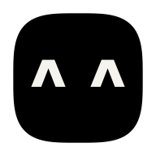

<p align="center"></p>

# OpenCharm

**Give your agent a body.** OpenCharm is a small open-source companion that becomes the face and voice of the AI agent you already run: Claude Code, Codex, Gemini CLI, Hermes Agent, OpenClaw, any ACP agent or anything OpenAI-compatible. It sits by your laptop or hangs from your keys. Hold its one key to talk; glance at its face to see what your agent is doing.

- **One agent at a time.** The charm is the body of an agent that already works. It doesn't replace your agent, your phone or your apps.
- **A face you can type.** Two characters for eyes and one for a mouth (`^ ^`, `o O`, `> <`), in its own colour on true black.
- **One key, three moves.** Hold to talk, press for everything else, tap the face.
- **About $32 of hardware** (September 2026 prices): a ready-made Waveshare board, plus a small speaker and an optional 3D-printed shell.

Site: [opencharm.dev](https://opencharm.dev) · Product spec: [OPENCHARM.md](OPENCHARM.md) · Look: [DESIGN.md](DESIGN.md) · Build one: [docs/build.md](docs/build.md) · Run charmd on a server: [docs/deploy.md](docs/deploy.md) · No hardware? [the desktop charm](apps/desktop/README.md)

## Status

Early. Tested end to end on macOS (3 October 2026): `opencharm init`, charmd (the charm daemon), the emulator and Claude Code, from pairing to a spoken answer through a real microphone. The desktop charm runs on macOS; its Windows build is untested on a real machine. charmd also has presets for Codex, Gemini CLI, goose, Hermes and OpenClaw, and adapters for OpenAI-compatible agents: covered by tests with a stand-in agent, not yet each tried for real. Firmware for the real board (spec 009) is next. Work is specified spec by spec ([specs/](specs/README.md)).

## Try it

```bash
npx opencharm            # the face in your terminal
npx opencharm faces      # all 22 moods
npx opencharm hardware   # what to buy and print
```

**Your own charm, in your browser** (Node 24, git, and an agent such as Claude Code):

```bash
npm i -g opencharm
opencharm init my-charm && cd my-charm   # your charm's workspace (default name Momo)
opencharm serve                          # charmd; it runs your agent in charm/
opencharm sim                            # in another terminal: the charm in your browser
opencharm pair <code>                    # the code on its screen; then choose a PIN
```

Hold Space and talk. The workspace's README covers the voice (local on macOS, or OpenAI).

**The desktop charm (macOS).** Download it from [Releases](https://github.com/opencharm-labs/opencharm/releases) ([how](apps/desktop/README.md)). In Settings, choose your agent's folder, then hold **⌥ Space** and talk.

**The emulator, from source** (Node 24; Emscripten, see [CONTRIBUTING.md](CONTRIBUTING.md)):

```bash
npm ci
npm run firmware:sim         # build the emulator
npm run cli -- serve         # charmd; keep it running
npm run sim                  # in another terminal: the charm in your browser
npm run cli -- pair <code>   # the code on its screen; then choose a PIN
```

## Develop

```bash
npm ci
npm run check            # format, lint, typecheck, tests, Python lint
npm run dev              # the website
npm run cli -- faces     # the CLI from source
```

How we work (specs, branches, PRs, agents): [CONTRIBUTING.md](CONTRIBUTING.md). Coding agents start at [AGENTS.md](AGENTS.md).

## Licences

| What                                                              | Licence                                                                                              |
| ----------------------------------------------------------------- | ---------------------------------------------------------------------------------------------------- |
| Software and firmware (everything not listed below)               | [MIT](LICENSE)                                                                                       |
| Hardware designs (`hardware/`)                                    | [CERN-OHL-S-2.0](LICENSES/CERN-OHL-S-2.0.txt)                                                        |
| Docs, brand art, face designs (`docs/`, `brand/`, `OPENCHARM.md`) | [CC BY-SA 4.0](LICENSES/CC-BY-SA-4.0.txt)                                                            |
| Fonts (`firmware/core/fonts/`)                                    | Geist Mono and Noto Sans Symbols 2, SIL OFL 1.1 (licence files next to them)                         |
| Third party                                                       | three.js (MIT, `hardware/prototype/vendor/`), Waveshare drawings (Apache-2.0, `hardware/reference/`) |

What ships compiled into our binaries comes with its own notices:

- LVGL, cJSON and libopus in the WebAssembly: `firmware/sim/THIRD_PARTY_NOTICES.md`
- the desktop app's Rust crates: generated at build time

The OpenCharm name and logo are not licensed for use as your own brand.

## No warranty

OpenCharm is an open-source project. Everything in this repository (software, firmware, hardware designs, 3D models, build guides and documentation) is provided **"as is", without warranty of any kind**, express or implied, including but not limited to warranties of merchantability, fitness for a particular purpose and non-infringement.

- **At your own risk.** Building, flashing, charging, carrying and using a charm is your responsibility. In no event shall the authors or contributors be liable for any claim, damage, injury, data loss or other liability arising from the project or from building or using a device based on it.
- **Batteries.** Lithium batteries can swell, overheat or catch fire if damaged, crushed, mis-wired or charged wrongly. Follow [docs/build.md](docs/build.md) section 3, never leave a charging device unattended, and stop using any battery that is swollen, hot or damaged.
- **Not a certified product.** A charm built from this repo has no CE, FCC, UL or other certification as a finished product. Third-party parts are covered only by their makers' terms.
- **Not for critical use.** Don't rely on the charm for safety, medical, emergency or time-critical purposes, including timers, alarms or reminders set through it.
- **Your agent, your responsibility.** The charm talks to an AI agent you run and configure; what that agent does is up to you and its own software.
- **We sell nothing.** There are no sales, pre-orders, payments or waitlists, and we ship no devices. You build your own charm from the open files.

Not affiliated with Meta, Nous Research, OpenClaw, Waveshare or Espressif.
